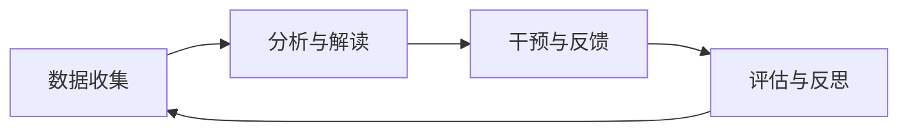

# 🧩 **03_Core_Concepts_and_Frameworks_of_EDM_LA.md**  
## 🌟 **导入篇 —— 走进教育数据挖掘与学习分析的世界**  
### 🛠️ **第三讲：核心要素解构 —— EDM与LA的基本概念与框架**  

👋 **同学们好！**  
在前两讲中，我们了解了EDM/LA的基本概念与发展历程。今天，让我们解构EDM/LA的核心要素，掌握其项目实施的通用框架。  

## 🧠 **一、理解“学习”的核心模型**  
EDM/LA通过以下核心模型结构化学习现象：  

### **1. 👤 **学习者模型**：为每个学习者“画像”**  
**关键特征**：  
| 维度 | 示例 |  
|------|------|  
| 🧠 **认知状态** | 知识掌握程度、常见误解 |  
| 😊 **情感状态** | 学习兴趣、焦虑水平 |  
| 🛠️ **元认知能力** | 自我监控、学习策略 |  
| 🕒 **行为特征** | 学习习惯、拖延情况 |  
| 👥 **背景信息** | 先前知识、人口学特征 |  

**数据来源**：测验、在线行为、论坛发言、生理数据（如眼动）  

### **2. 📚 **领域模型**：描绘“学什么”的地图**  
**类型**：  
- 🌐 **概念图**：用节点和连线表示知识关系  
- 🌳 **技能树**：描述技能层级与依赖关系  
- 🗺️ **知识图谱**：课程内容的结构化表示  

### **3. 🏫 **教学模型**：设计“怎么教”的策略**  
**常见教学模型**：  
- 🎯 **问题解决式学习**  
- 🚀 **项目式学习**  
- 🔍 **探究式学习**  
- 👥 **协作学习**  
- 🎮 **游戏化教学**  

### **4. 📊 **评估模型**：衡量“学得怎样”的标尺**  
| 类型 | 作用 | 示例 |  
|------|------|------|  
| 📈 **形成性评估** | 监测进展、诊断问题 | 课堂提问、随堂测验 |  
| 📝 **总结性评估** | 评价学习结果 | 期末考试、毕业设计 |  

## 👥 **二、谁在乎？—— EDM/LA的主要利益相关者**  
| 角色 | 关注点 | EDM/LA支持 |  
|------|--------|------------|  
| 👨🎓 **学习者** | 个性化支持、数据隐私 | 学习预警、资源推荐 |  
| 👩🏫 **教师** | 学情分析、教学设计优化 | 班级学情概览、作业自动批改 |  
| 🏫 **管理者** | 教学质量、资源配置 | 毕业率分析、课程发展报告 |  
| 🔬 **研究者** | 学习理论验证、方法创新 | 大规模学习数据、计算实验场域 |  
| 📜 **政策制定者** | 教育公平、政策评估 | 区域教育监测、公平性分析 |  

## 🚧 **三、按图索骥——EDM/LA的通用框架与流程**  
### **CRISP-DM教育领域适应性调整**  
1. **教育理解** 🎯  
   - 明确教育问题：如何降低在线课程辍学率？  

2. **数据理解** 🔍  
   - 收集LMS数据，探索完整性与准确性  

3. **数据准备** 🧹  
   - 清洗数据、处理缺失值、特征构建  

4. **建模** 🤖  
   - 应用分类、聚类等算法分析数据  

5. **评估** ✅  
   - 技术指标：准确率、召回率  
   - 教育价值：结果是否指导实践？  

6. **部署/应用** 🚀  
   - 集成预警模型到LMS，推荐个性化资源  

### **学习分析迭代循环**  

## 📌 **总结与思考**  
### **本讲重点回顾** 🌟：  
- 🔍 **核心模型**：学习者、领域、教学、评估  
- 👥 **利益相关者**：学习者、教师、管理者等  
- 🚧 **通用流程**：教育理解→数据准备→建模→评估→部署  

### **互动探索** 💬：  
1. 🤔 **选择一门课程**，思考其中的四种模型和利益相关者  
2. 🌟 **CRISP-DM的哪个阶段**对文科生最具挑战？为什么？  
3. 💡 **部署EDM/LA结果时**，可能遇到哪些阻力？  

## 🚀 **下一讲预告**  
📜 **第四讲：伦理先行 —— EDM与LA的责任边界与挑战**  
- 数据隐私、算法偏见等伦理风险  
- 负责任的EDM/LA设计与实践原则  

**敬请期待！** 🎉

